[TOC]

•	首頁
•	餘額列表
	◦	幣別排序設定
•	各幣別首頁
•	歷史交易
	◦	明細頁
	◦	排序/篩選頁
	◦	日期選擇器
	◦	聯絡人選擇器
•	個人設定
	◦	設定我
	◦	設定語言
	◦	設定預設幣別
•	匯率
•	聯絡人 (待完成)
•	存提 (待完成)
•	收付款 (待完成)
•	換匯 (待完成)
•	關於我們/使用協議/隱私政策
•	撰寫評論
•	常見問題/提問

---

# 首頁
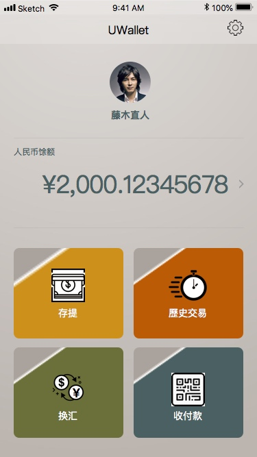

- avatar預設路徑改為空字串

---
# 餘額列表
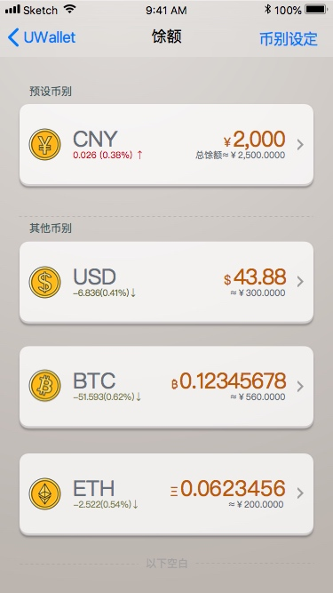

- 導覽頁(半透明覆蓋)(暫時不做動畫)

## 幣別排序設定
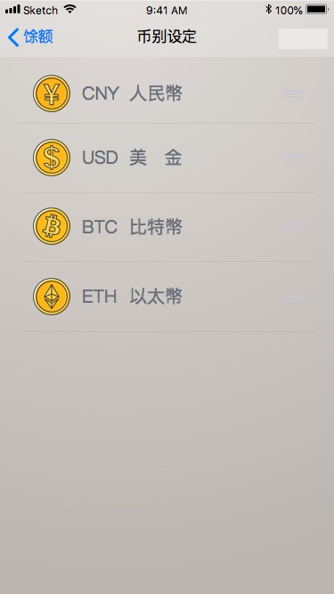

- 導覽頁(半透明覆蓋)(暫時不做動畫)
- 長按移動順序

---
# 各幣別首頁

---
# 歷史交易
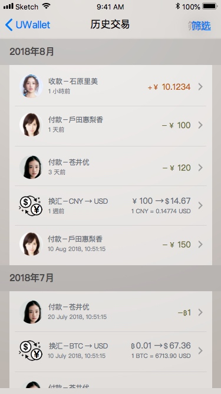

## 明細頁
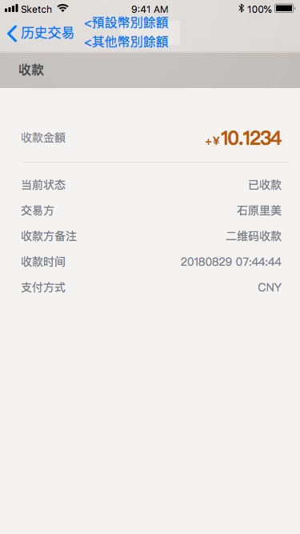

## 排序/篩選頁

## 日期選擇器
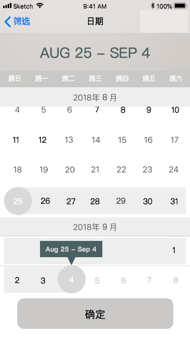

## 聯絡人選擇器
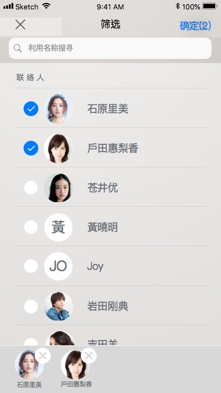

---
# 個人設定

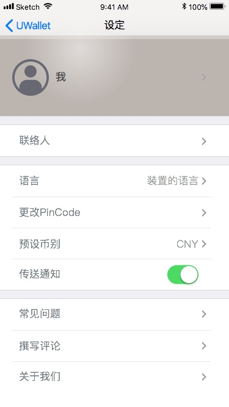

## 設定我
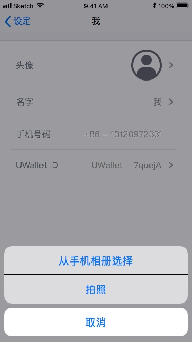
- 相機
- 相簿

## 設定語言
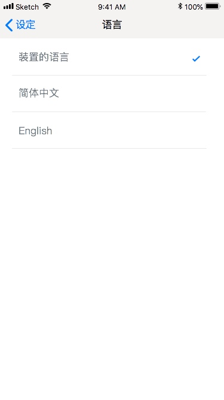

## 設定預設幣別
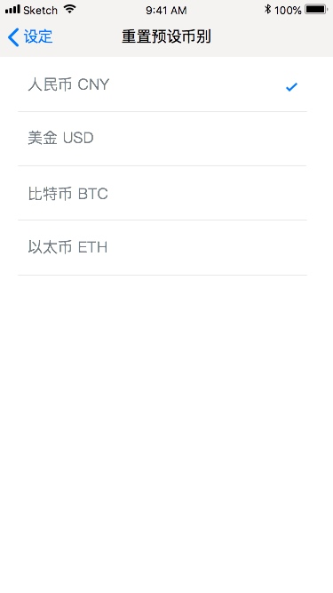

# 匯率

# 聯絡人 (待完成)

# 存提 (待完成)

# 收付款 (待完成)

# 換匯 (待完成)

# 關於我們/使用協議/隱私政策

# 撰寫評論

# 常見問題/提問

