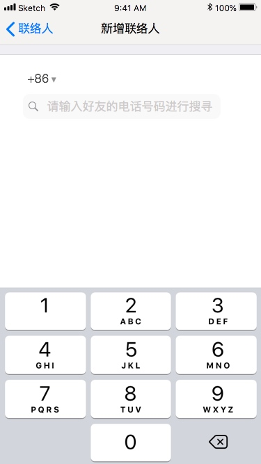
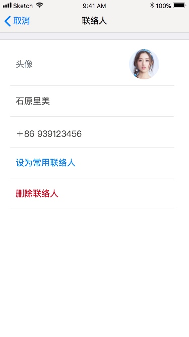
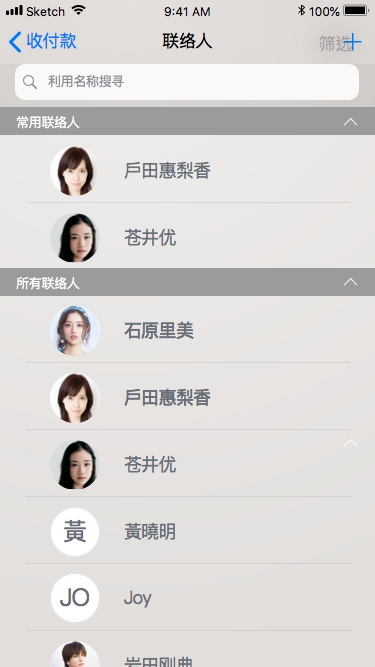
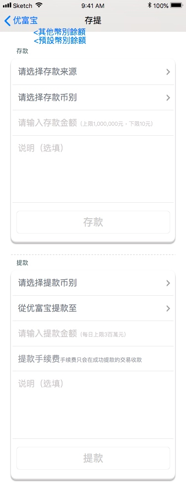
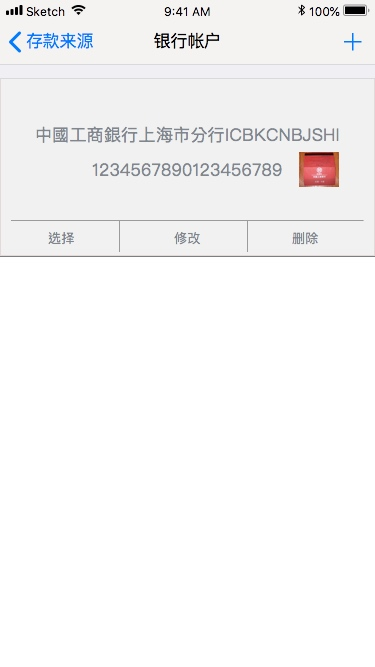
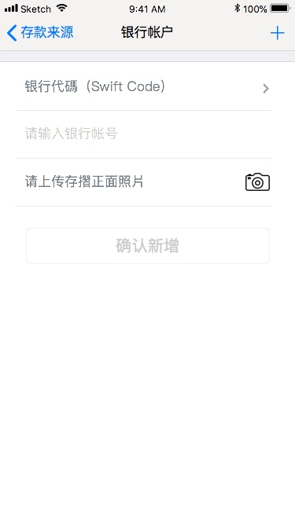
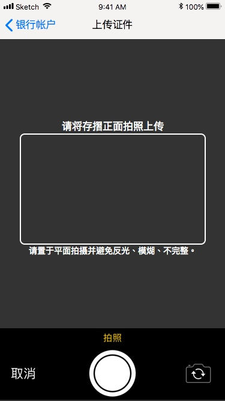
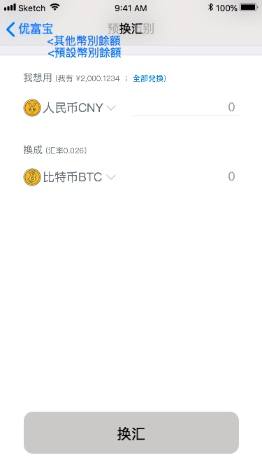
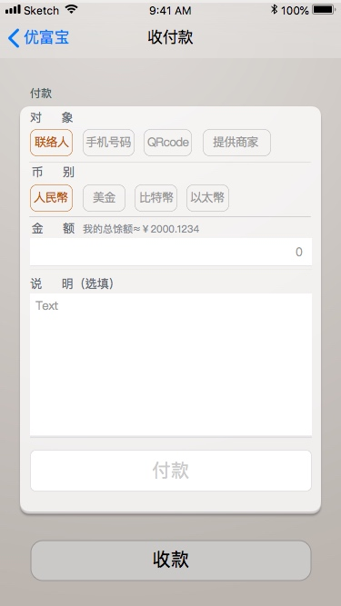
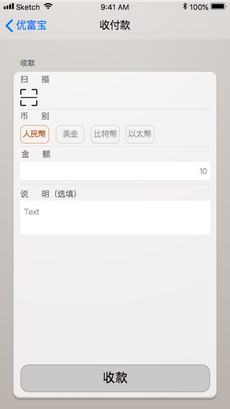

> 詳細內容以Olivia發佈的為準

10-14 / 3week
11-13 / 3week


[TOC]
```
	•	要點
	•	v1.1
	•	首頁
	•	餘額列表
		◦	幣別排序設定
	•	各幣別首頁
	•	歷史交易
		◦	明細頁
		◦	排序/篩選頁
		◦	日期選擇器
		◦	聯絡人選擇器
	•	個人設定
		◦	設定我
		◦	設定語言
		◦	設定預設幣別
	•	匯率
	•	聯絡人 (v1.1)
		◦	新增
		◦	編輯
		◦	選擇器(常用聯絡人)
	•	存提 (v1.1)
		◦	銀行卡 新增/選擇
		◦	自訂相機
	•	換匯 (v1.1)
	•	收付款 (v1.1)
		◦	付款
		◦	收款
	•	關於我們/使用協議/隱私政策
	•	撰寫評論 (暫無)
	•	常見問題/提問 (暫無)
	•	App版本檢查 (暫無)
	•	附錄
	◦	QRCode定義
		▪	個資QRCode (固定加入generater頭像)
		▪	收款QRCode (標價)
		▪	付款QRCode (被動支付)
	◦	v2.0 註冊/登入機制 簡述
```

---


# 要點
- 掃描QRCode僅能從相機掃描 不需從檔案
- QRCode不同type不能互用 資訊不能再次修改

# v1.1
- 登入流程/實名認證/使用協議 **先不更動** 下個版本再做
- 要做`重構`可以趁機施工

# v2.0
- 以連結啟動app (分享資訊)


# 首頁


- avatar預設路徑改為空字串

---
# 餘額列表


- 導覽頁(半透明覆蓋)
- 不用右滑


## 幣別排序設定


- 導覽頁(半透明覆蓋)(暫時不做動畫)
- 長按移動順序

---
# 各幣別首頁


---
# 歷史交易


## 明細頁


## 排序/篩選頁


## 日期選擇器


## 聯絡人選擇器


- 暫時以空白頭像 替代文字頭像

---
# 個人設定


## 設定我

- 相機
- 相簿

## 設定語言


## 設定預設幣別


# 匯率


# 聯絡人 (v1.1)
## 新增


國旗照樣先留著

## 編輯



## 選擇器(常用聯絡人)

(確定用此版)

# 存提 (v1.1)


## 銀行卡 新增/選擇


每個cell都有各自的`選擇/修改/刪除`



## 自訂相機


# 換匯 (v1.1)



# 收付款 (v1.1)

## 付款

`聯絡人/手機號碼/QRCode`三者屬於`主動式`付款.
`提供商家`屬於`被動式`付款,僅產生QRCode

## 收款


按`掃描` 直接掃描QRCode進行收款
或按`收款`產生收款`QRCode`

# 關於我們/使用協議/隱私政策

# 撰寫評論 (暫無)

# 常見問題/提問 (暫無)

# App版本檢查 (暫無)


# 附錄
## QRCode定義
- 以json明碼字串直接編碼
- 每個QRCode依type規範其對應的操作行為 **不可通用**

```js
{
	"type" : "",
	"generator": "",	//產生QRCore的人
	"payer" : "",	//付款人
	"payee" : "",	//收款人
	"currency" : "",	//幣別
	"amount" : "",	//總額
	"message" : "",	//附加訊息
	"payerOTP" : "",	//付款人 的 一次性密碼(for paymnent)
}
//OTP機制選定
```

### 個資QRCode (固定加入generater頭像)

> 情境 : 某A產生`個資QRCode`於`手機螢幕` 或 傳`送給`某B掃描 以加入聯絡人

```js
{
	"type" : "person",
	"generator": "id-jim",
	"payer" : "",
	"payee" : "",
	"currency" : "",
	"amount" : "",
	"message" : "",
	"payerOTP" : "",
}
```

### 收款QRCode (標價)

> 情境 : 商家產生`收款QRCode`貼於店內 供過路客`掃碼付款`

```js
//商家store標價CNY100 給顧客購買
{
	"type" : "receive",
	"generator": "id-store",
	"payer" : "",
	"payee" : "id-store",
	"currency" : "CNY",
	"amount" : "100",
	"message" : "杯子",
	"payerOTP" : "",
}
```

### 付款QRCode (被動支付)

> 情境 : 顧客產生`付款QRCode`於`手機螢幕` 供商家`掃碼收款`

```js
//顧客提供OTP讓商家有權扣款
{
	"type" : "transfer",
	"generator": "id-customer",
	"payer" : "id-customer",
	"payee" : "",
	"currency" : "",
	"amount" : "",
	"message" : "",
	"payerOTP" : "xxxxx",
}
//定義小額/離線付款上限機制
```

## v2.0 註冊/登入機制 簡述

- 以`phoneno+pwd`註冊
- 登入帳號可為`phoneno`或`email` (email須經驗證)
- 首次登入(未取得JWT時)時需通過`簡訊驗證`
- 閒置N時間後登出 onStart再重新登入
- 本地端可記住`帳密` 提供`快速登入`(pincode/生物辨識)
- 實名認證與email均通過後才開通交易


